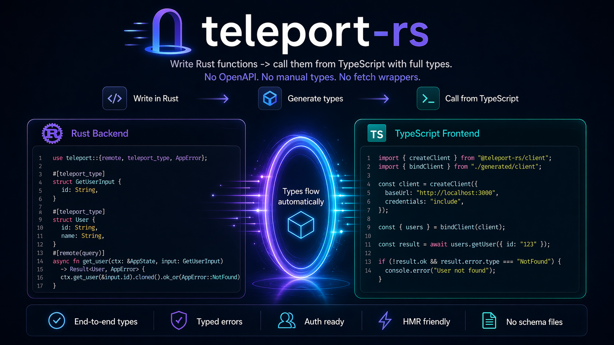

# teleport-rs

<p align="center">
  
</p>

Feels like SvelteKit remote functions, but your backend is native.

Typed backend functions with generated TypeScript clients for Vite-style frontends.
No OpenAPI. No manual TypeScript types. No handwritten fetch wrappers.

## What It Is

`teleport-rs` lets you write native backend procedures and call them from TypeScript with end-to-end types:

- backend input/output types become TypeScript types
- `AppError<T>` becomes a typed client-side error union
- a client is generated for your frontend automatically

It started as a Rust-first project and Rust is still the flagship implementation. Internally, the generator now runs from a language-neutral contract bundle, so Rust is the first implementation of the contract rather than the only possible one.

The repo also contains `.NET` and Go implementations under [dotnet/](dotnet/) and [go/](go/) that target the same contract and generation flow.

The shared cross-language flow is:

- a native backend exports `teleport.contract.json`
- `teleport-cli generate-ts` turns that contract into `types.ts`, `errors.ts`, and `client.ts`
- the frontend binds the same generated client shape regardless of whether the backend is Rust, `.NET`, or Go

## Example

**Rust**

```rust
use teleport::{remote, teleport_type, AppError};

#[teleport_type]
struct GetUserInput {
    id: String,
}

#[teleport_type]
struct User {
    id: String,
    name: String,
}

#[remote(query)]
async fn get_user(ctx: &AppState, input: GetUserInput) -> Result<User, AppError> {
    ctx.get_user(&input.id).cloned().ok_or(AppError::NotFound)
}
```

**TypeScript**

```ts
import { createClient } from "@teleport-rs/client";
import { bindClient } from "./generated/client";

const client = createClient({
  baseUrl: "http://localhost:3000",
  credentials: "include",
});

const { users } = bindClient(client);

const result = await users.getUser({ id: "123" });

if (result.ok) {
  console.log(result.data.name);
}
```

## Why Use It

- No schema files like OpenAPI or protobuf
- No manual TypeScript type maintenance
- No route-string-plus-fetch boilerplate in the frontend
- Typed errors flow from backend procedures to TypeScript
- Works with your existing native backend stack

## Implementations

- Rust: first-party reference implementation
- .NET: first-party ASP.NET Core implementation under [dotnet/](dotnet/)
- Go: first-party `net/http` implementation under [go/](go/)

The TypeScript generation flow is shared across implementations through `teleport.contract.json`.

## The Pitch

This is basically:

- SvelteKit remote functions, but your backend stays native
- tRPC-style end-to-end typing, but for Rust, `.NET`, and Go servers
- contract-based TypeScript generation plus a real procedure layer

Instead of moving backend logic into `.remote.ts` files, you keep the logic in your backend language and call it from the frontend like a typed function.

## When It Makes Sense

Use `teleport-rs` if you have:

- a Vite or Svelte-style frontend
- a native backend you want to keep native
- a single product codebase where frontend and backend evolve together
- a strong preference for app-level DX over public API standardization

## When Not To Use It

- Public third-party APIs: use OpenAPI
- Multiple independent client languages: use OpenAPI or gRPC
- Pure SvelteKit backend: use SvelteKit remote functions
- Pure TypeScript full-stack app: use tRPC

## Comparisons

### vs Axum + JSON routes

- Axum alone gives you routes and handlers
- you still write fetch calls manually
- you still keep frontend types in sync yourself

`teleport-rs` removes that glue layer.

### vs Axum + Specta

- Specta gives you shared types
- it does not give you typed procedure calls by itself

`teleport-rs` adds the RPC/client layer on top.

### vs rspc

- similar category: typed RPC across frontend and backend
- `teleport-rs` is more opinionated around native backends plus a Vite/Svelte-style frontend flow

### vs tRPC

- tRPC is for a TypeScript backend
- `teleport-rs` is for native Rust, `.NET`, and Go backends

### vs SvelteKit remote functions

- remote functions assume SvelteKit is your backend
- `teleport-rs` gives a similar frontend experience when your backend is native

## How It Works

1. Declare native procedures in Rust, `.NET`, or Go
2. Export `teleport.contract.json` from the backend
3. Run `teleport-cli generate-ts` to write `types.ts`, `errors.ts`, and `client.ts`
4. Bind the generated client to a configured runtime client
5. Call backend procedures from TypeScript as typed functions

## Features

- `#[remote(query)]`, `#[remote(command)]`, `#[remote(form)]`
- Typed `Result<T, AppError<E>>` to TypeScript unions
- Procedure-specific typed error details
- Auth support with `#[auth]`
- Vite plugin with binding-aware HMR
- Shared `teleport.contract/v1` export for Rust, `.NET`, and Go
- No handwritten frontend schema/config layer in normal app usage

## Stack

- Rust
- Axum
- Specta
- .NET / ASP.NET Core
- Go / `net/http`
- TypeScript client runtime
- Vite plugin for generated bindings and HMR

## Status

Rust, `.NET`, and Go are first-party implementations in this repo. The shared contract schema is versioned as `teleport.contract/v1`, and each implementation is expected to keep generated TypeScript bindings compatible with that contract.

## Getting Started

- Full walkthrough: [docs/getting-started.md](docs/getting-started.md)
- Architecture: [docs/architecture.md](docs/architecture.md)
- Error handling: [docs/error-handling.md](docs/error-handling.md)
- `.NET` implementation notes: [dotnet/README.md](dotnet/README.md)
- Go implementation notes: [go/README.md](go/README.md)
- Starter example: [examples/starter/](examples/starter/)
- Demo app: [examples/demo/](examples/demo/)

For local repo development, use npm workspaces:

```bash
npm install
npm run build:js
npm run demo:export
npm run demo:export:dotnet
npm run demo:export:go
npm run dotnet:build
npm run dotnet:test
npm run go:build
npm run go:test
```

For repeatable local coverage runs against production code only:

```bash
nix develop -c ./scripts/coverage-rust.sh
nix develop -c ./scripts/coverage-go.sh
nix develop -c ./scripts/coverage-dotnet.sh
```

These write reports under `coverage/rust`, `coverage/go`, and `coverage/dotnet`.
Rust excludes workspace examples and reports `teleport-cli` separately. Go measures only `go/teleport` and `go/teleporthttp`. `.NET` measures only `dotnet/src/Teleport.Net*` and excludes `dotnet/tests/Teleport.Net.TestFixtures`.

## Goal

Make a native backend and a TypeScript frontend feel like one app.

Without:

- schema files
- type drift
- handwritten client glue

## License

MIT
